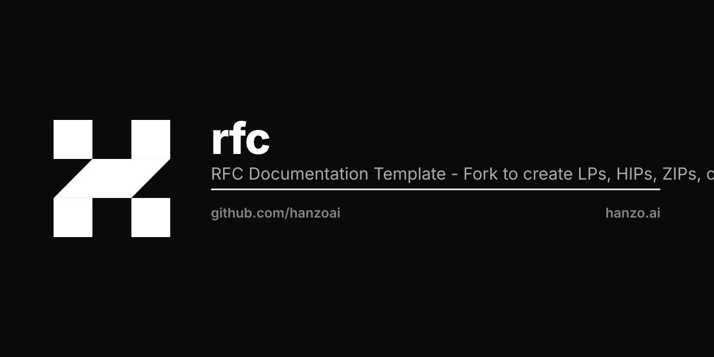

<p align="center"></p>

# @hanzo/rfc

RFC Documentation Template for building proposal documentation sites.

## Overview

This template provides a ready-to-use documentation site for RFC-style proposals like:
- **LPs** (Lux Proposals) - lps.lux.network
- **HIPs** (Hanzo Improvement Proposals) - hips.hanzo.ai
- **ZIPs** (Zoo Improvement Proposals) - zips.zoo.ngo
- Custom proposal systems

## Quick Start

1. **Copy this template** to your project:
```bash
cp -r ~/work/hanzo/rfc ~/work/your-org/your-proposals
cd ~/work/your-org/your-proposals
```

2. **Configure** by editing `rfc.config.ts`:
```typescript
const config: RFCConfig = {
  name: 'Your Proposals',
  shortName: 'YP',
  title: 'Your Proposals - Standards Documentation',
  // ... see examples/ for full configurations
};
```

3. **Install dependencies**:
```bash
pnpm install
```

4. **Run development server**:
```bash
pnpm dev
```

5. **Build for production**:
```bash
pnpm build
```

## Configuration

See `rfc.config.ts` for all configuration options:

- **Site identity**: name, title, description
- **URLs**: baseUrl, repoUrl, forumUrl
- **Content**: rfcDir (where your markdown files live), filePrefix
- **Categories**: Define categories with number ranges
- **Branding**: Colors, logo
- **Theme**: Dark/light mode settings

## Example Configurations

See the `examples/` directory for ready-to-use configurations:

- `examples/lps.config.ts` - Lux Proposals
- `examples/hips.config.ts` - Hanzo Improvement Proposals
- `examples/zips.config.ts` - Zoo Improvement Proposals

## Directory Structure

```
your-proposals/
├── docs/                    # This documentation site
│   ├── app/                 # Next.js app router
│   ├── components/          # React components
│   ├── lib/                 # Core logic (source.ts)
│   ├── public/              # Static assets
│   ├── rfc.config.ts        # Site configuration
│   └── package.json
└── RFCs/                    # Your proposal markdown files
    ├── rfc-0001.md
    ├── rfc-0002.md
    └── ...
```

## Markdown Format

RFC files should include YAML frontmatter:

```yaml
---
rfc: 1
title: Your Proposal Title
description: A brief description
author: Name (@github-username)
status: Draft | Review | Last Call | Final | Withdrawn
type: Standards Track | Meta | Informational
category: Core | Networking | Interface
created: 2025-01-01
---

## Abstract

Your proposal content...
```

## Features

- 📝 Markdown with GFM support
- 🎨 Dark/light theme
- 🔍 Full-text search
- 📱 Mobile responsive
- ⚡ Static site generation
- 📊 Proposal statistics
- 🏷️ Category organization
- 🔗 TOC navigation

## Built On

- [Next.js 16](https://nextjs.org)
- [@hanzo/docs](https://github.com/hanzoai/docs)
- [@hanzo/mdx](https://github.com/hanzoai/mdx)
- [@hanzo/ui](https://github.com/hanzoai/ui)
- [Tailwind CSS 4](https://tailwindcss.com)

## License

MIT
